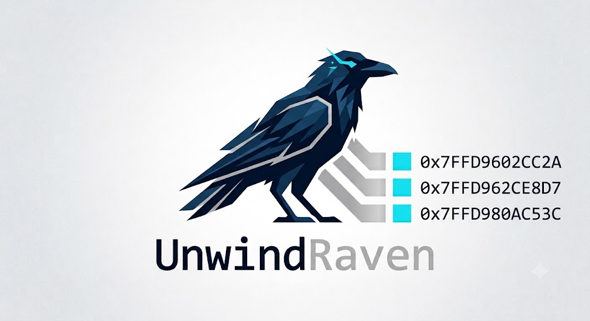

# UnwindRaven

<p align="center">
  
</p>

## Overview

UnwindRaven is a Windows x64 offensive research framework that constructs **fully synthetic call stacks** at thread startup time, making a newly created thread appear — to stack-walking debuggers, EDR sensors, and kernel callbacks — as though it was legitimately invoked by a chain of known, trusted system frames.

### Prior Art

UnwindRaven stands on the shoulders of two pieces of foundational x64 call-stack manipulation research.

**WithSecure Labs' [VulcanRaven](https://github.com/WithSecureLabs/CallStackSpoofer)** — documented in their [*Spoofing Call Stacks to Confuse EDRs*](https://labs.withsecure.com/blog/spoofing-call-stacks-to-confuse-edrs) blog post — established the foundational primitive set that UnwindRaven's core directly descends from: parse a target function's `UNWIND_INFO` record at runtime via `CalculateFunctionStackSize()`, use the decoded frame size to place the correct amount of stack space, push synthetic return addresses into that allocation via `PushToStack`, and install a Vectored Exception Handler to absorb the terminal access violation when the fake chain is exhausted. The three call-chain profiles (`--wmi`, `--rpc`, `--svchost`) were harvested from live SysMon process-access events targeting lsass handle operations. That hardcoding was a deliberate PoC constraint: each profile embeds version-specific offsets validated only against Windows 10 21H2 (build 19044.1706), meaning any change in target OS build requires recompilation and re-measurement.

**klezVirus' [BYOUD — *Bring Your Own Unwind Data*](https://github.com/klezVirus/BYOUD)** approaches the problem from the opposite direction. Rather than constructing a synthetic stack that *looks* correct to a stack walker, BYOUD manipulates the PE exception-directory metadata that the stack walker *consults* — rewriting the ground truth rather than faking the evidence. Its seven techniques span the full spectrum of metadata subversion: in-place `UNWIND_INFO` tampering (`UNWIND_DATA_TAMPER`), donor-frame `UnwindData` RVA substitution (`UNWIND_DATA_HIJACK`), `.pdata` entry hijacking to cover a shellcode address range (`RT_FUNCTION_HIJACK`), appending entirely new `RUNTIME_FUNCTION` and `UNWIND_INFO` records to the exception directory (`RT_FUNCTION_INJECT`), and three variants of dynamic registration via `RtlAddFunctionTable` with differing debugger and EDR visibility characteristics. The central insight — that `UNWIND_INFO` is not a read-only compiler artifact but a live data structure that can be authored, substituted, or extended at runtime — is what the *"Bring Your Own"* framing captures.

### Where UnwindRaven Fits

UnwindRaven takes VulcanRaven's battle-tested primitives (`CalculateFunctionStackSize`, `PushToStack`, VEH cleanup) and makes the frame chain **entirely data-driven**. A plain-text blueprint file replaces compiled-in profiles, and the companion `BlueprintCallstack` harvester captures those blueprints directly from live process snapshots — making the tool immediately portable across Windows versions without recompilation. From BYOUD, UnwindRaven inherits the discipline of treating the PE exception directory as a first-class runtime data source: every synthetic frame's precise stack footprint is derived by reading the target module's existing `UNWIND_INFO` records rather than relying on hardcoded sizes or offsets. A lightweight integrated PE loader rounds out the framework, enabling test payloads to be exercised directly against the synthetic stack, keeping the research workflow entirely self-contained.

The core pipeline is as follows: before an entry point is called, UnwindRaven:

1. Parses a **blueprint file** that describes the desired fake call chain (module → exported symbol → in-function offset).
2. Resolves each frame's true stack footprint by parsing the PE's `UNWIND_INFO` metadata for that function.
3. Allocates a contiguous synthetic stack, pushes the correct return addresses and register saves into it, and builds a spoofed `CONTEXT` record that points `RSP`/`RIP` at the top of this fake chain.
4. Manually maps the payload DLL, resolves its imports, applies relocations, sets section permissions, and launches it on the spoofed thread.
5. Installs a **Vectored Exception Handler** that intercepts any access violation produced when the synthetic return chain is eventually unwound, gracefully redirecting the thread to `RtlExitUserThread`.

The result is a thread whose stack, as seen by any observer relying on `StackWalk64` or `RtlVirtualUnwind`, looks like it originated from a legitimate Windows execution path.

---

## Features

| Feature | Detail |
|---|---|
| Blueprint-driven stack construction | Fake frame chain is fully data-driven via a plain-text blueprint file |
| UNWIND\_INFO–accurate frame sizing | Parses `UWOP_PUSH_NONVOL`, `ALLOC_SMALL`, `ALLOC_LARGE`, `SET_FPREG`, and `PUSH_MACHFRAME` opcodes |
| Manual PE loader | Maps sections, applies base relocations, resolves IAT, tunes section permissions — no `LoadLibrary` |
| VEH-based thread cleanup | Vectored Exception Handler catches the terminal AV and exits the thread cleanly |
| WOW64-aware profiler | Live profiling mode supports both native x64 and 32-bit (WOW64) target threads |
| Blueprint Harvester tool | `BlueprintCallstack` captures exported-frame blueprints directly from any running process |
| Symbol-server integration | Configured for `https://msdl.microsoft.com/download/symbols` out of the box |
| MSVC-optimised build | Uses `/Oy-` to guarantee frame pointers are present; assembly listings emitted for analysis |

---

## How It Works

```
 ┌──────────────────────────────────────────────────────────────────────┐
 │                        UnwindRaven Flow                              │
 │                                                                      │
 │  blueprint.txt          UnwindRaven.exe          payload.dll         │
 │  ┌───────────┐          ┌────────────┐           ┌────────────┐      │ 
 │  │ntdll.dll  │  parse   │ Load       │  map      │ DllMain    │      │
 │  │NtWaitFor… │ ───────► │ Blueprint  │ ────────► │ (payload)  │      │
 │  │kernel32   │          │            │           └────────────┘      │
 │  │...        │          │ Resolve    │                               │
 │  └───────────┘          │ Frames     │  Each frame's stack size      │
 │                         │ (UNWIND_   │  calculated from PE metadata  │
 │                         │  INFO)     │                               │
 │                         │            │                               │
 │                         │ Build      │  Synthetic stack allocated;   │
 │                         │ Synthetic  │  return addresses + saved     │
 │                         │ Stack      │  regs pushed per frame        │
 │                         │            │                               │
 │                         │ Map PE     │  Manual loader: sections,     │
 │                         │ (no        │  relocs, IAT, permissions     │
 │                         │  LoadLib)  │                               │
 │                         │            │                               │
 │                         │ Spoof      │  SetThreadContext on a        │
 │                         │ Thread     │  suspended thread — RSP/RIP   │
 │                         │ Context    │  point into synthetic stack   │
 │                         │            │                               │
 │                         │ VEH        │  AV on unwind → redirected    │
 │                         │ Installed  │  to RtlExitUserThread         │
 │                         └────────────┘                               │
 └──────────────────────────────────────────────────────────────────────┘
```

---

## Synthetic Stack Spoofing

### Frame Resolution

For each entry in the blueprint, `BuildSyntheticStackFromBlueprint` (in `src/synthetic_stack.c`) locates the target module in the current process (or loads it on demand when `needLoad == 1`) and resolves the function address via `GetProcAddress` or a manual export-table walk (`GetRvaFromName`).

The function's precise stack usage is then determined by parsing the PE's exception directory. `CalculateFunctionStackSize` decodes every `UNWIND_CODE` record:

| Opcode | Effect counted |
|---|---|
| `UWOP_PUSH_NONVOL` | +8 bytes (one GPR push) |
| `UWOP_ALLOC_SMALL` | +(info+1)×8 bytes |
| `UWOP_ALLOC_LARGE` | slot 1: info×8; slot 2: raw DWORD |
| `UWOP_SET_FPREG` | frame pointer establishment, no size change |
| `UWOP_PUSH_MACHFRAME` | +40 or +48 bytes (hardware exception frame) |

### Stack Layout

A single contiguous allocation (`VirtualAlloc`, `PAGE_READWRITE`) holds the entire synthetic stack. `PushToStack` walks from the bottom of the allocation toward lower addresses, placing:

- **Return address** for each frame (resolved export VA + in-function offset)
- **Non-volatile register saves** mandated by that frame's `UNWIND_INFO`

After all frames are pushed, `InitializeFakeThreadState` zeroes a `CONTEXT` structure and sets:

```c
ctx.Rsp = <top of synthetic stack>
ctx.Rip = <entry point of innermost fake frame>
```

`SetThreadContext` is then called on the suspended thread before it is resumed.

### VEH Cleanup

Once the payload finishes and the synthetic return chain is walked off the end of the real stack, an access violation fires. The installed VEH (`VehCallback` in `src/veh.c`) checks for `EXCEPTION_ACCESS_VIOLATION` and redirects `RIP` to `RtlExitUserThread(0)`, ensuring the thread exits cleanly without crashing the host process. To avoid a detectable import, `RtlExitUserThread` is resolved at runtime via a manual `GetLocalProcAddressManual` walk of `ntdll.dll`'s export table.

---

## Blueprint Harvester

`BlueprintCallstack` (`tools/blueprint-callstack.c`) is the companion tool used to **capture real call-stack blueprints from legitimate Windows processes** that exhibit the desired apparent call chain.

### How It Works

1. Opens the target process with `PROCESS_QUERY_INFORMATION | PROCESS_VM_READ`.
2. Suspends the target thread and captures its `CONTEXT`.
3. Calls `StackWalk64` + `SymFromAddr` to enumerate frames.
4. For each frame, performs a **manual export-table walk** (`GetExportRva`) to verify the symbol is actually exported — non-exported frames are silently skipped because they cannot be reconstructed across process boundaries (no stable RVA).
5. Normalises the module path to a canonical `%SystemRoot%\System32\…` form.
6. Emits one line per exported frame in the blueprint format.

### Usage

```
# Harvest from any thread in a process (auto-selects first thread)
BlueprintCallstack.exe --pid <PID> [--out blueprint.txt]

# Harvest from a specific thread
BlueprintCallstack.exe --thread <PID> <TID> [--out blueprint.txt]
```

### Blueprint Format

Each line of the output (and the input consumed by UnwindRaven) follows this pipe-delimited schema:

```
<module_path>|<exported_function>|<0xOffset>|<needLoad>
```

| Field | Description |
|---|---|
| `module_path` | Canonical absolute path to the DLL (System32-normalised) |
| `exported_function` | Exact exported symbol name |
| `0xOffset` | Byte offset from the start of the export (hex) |
| `needLoad` | `1` = UnwindRaven must `LoadLibrary` this module; `0` = already present |

**Example blueprint snippet:**

```
C:\Windows\System32\ntdll.dll|NtWaitForSingleObject|0x14|0
C:\Windows\System32\kernel32.dll|WaitForSingleObjectEx|0x8E|0
C:\Windows\System32\kernelbase.dll|WaitForSingleObjectEx|0x4C|0
C:\Windows\System32\kernel32.dll|BaseThreadInitThunk|0x14|0
C:\Windows\System32\ntdll.dll|RtlUserThreadStart|0x21|0
```

> **Note:** The harvester walks up to **128 frames** but emits only exported frames. Non-exported functions (anonymous thunks, inlined helpers) are intentionally omitted because they have no stable cross-process RVA.

---

## Build Instructions

> **MSVC is required.** MinGW/GCC can build the core library but **cannot** build `BlueprintCallstack` due to reliance on MSVC-specific COFF debug information and symbol-resolution APIs.

### Prerequisites

| Requirement | Version / Notes |
|---|---|
| Visual Studio | 2019 or 2022 (Desktop C++ workload) |
| CMake | 3.20 or later |
| Windows SDK | 10.0.19041.0 or later |
| Windows Driver Kit (WDK) | Required for the WDK-provided `dbghelp.dll` (x64 Debuggers path) |
| Symbol cache directory | `C:\Symbols` (created automatically on first run) |

### Clone

```powershell
git clone https://github.com/toneillcodes/UnwindRaven.git
cd UnwindRaven
```

### Configure and Build (PowerShell)

The repository ships a convenience script:

```powershell
.\build.ps1
```

Or manually with CMake using the Visual Studio generator:

```powershell
cmake -B build -G "Visual Studio 17 2022" -A x64
cmake --build build --config Release
```

Binaries are placed in `bin\`:

```
bin\
  UnwindRaven.exe
  UnwindRavenHellow.exe
  BlueprintCallstack.exe
  dbghelp.dll          ← copied from WDK at post-build
```

### Key Compiler Flags

| Flag | Purpose |
|---|---|
| `/Oy-` | **Disable frame-pointer omission** — required for accurate stack walking |
| `/Zi` / `/Z7` | Full debug information in PDB / embedded |
| `/FAs` `/FAcs` | Emit annotated assembly listings for analysis |
| `/DEBUG` | Link-time debug information |

---

## Directory Layout

```
UnwindRaven/
│
├── cmake/                      # CMake helper modules
│
├── examples/
│   ├── UnwindRaven.c           # Main example: blueprint load → stack spoof → payload run
│   └── UnwindRaven-Hellow.c    # Minimal "hello world" loader example
│
├── include/                    # Public headers
│   ├── unwindraven_core.h
│   ├── stack_blueprint.h
│   └── synthetic_stack.h
│
├── src/                        # Core static library sources
│   ├── common.c                # EnableDebugPrivilege, module/image helpers
│   ├── stack_blueprint.c       # Blueprint file parsing (LoadBlueprintFile)
│   ├── synthetic_stack.c       # Frame resolution, UNWIND_INFO parsing, stack construction
│   ├── pe_loader.c             # Manual PE mapper: sections, relocations, IAT, permissions
│   ├── veh.c                   # VEH installation and AV → RtlExitUserThread redirect
│   └── unwindraven_core.c      # High-level orchestration (MapPayloadImage, StartSpoofedLoaderThread)
│
├── tools/
│   └── blueprint-callstack.c   # Blueprint Harvester utility
│
├── CMakeLists.txt
├── build.ps1                   # PowerShell build helper
└── LICENSE                     # GPL-3.0
```

---

## Example Usage

### 1 — Capture a Blueprint

Run `BlueprintCallstack` against any process exhibiting the call chain you want to mimic. `notepad.exe` waiting on user input is a good example:

```powershell
# Find Notepad's PID
$pid = (Get-Process notepad).Id

# Harvest and save
.\bin\BlueprintCallstack.exe --pid $pid --out .\blueprints\notepad_wait.txt
```

Sample output:

```
[+] Harvesting blueprint from PID 4812, TID 7640

C:\Windows\System32\win32u.dll|NtUserGetMessage|0x14|0
C:\Windows\System32\user32.dll|GetMessageW|0x4A|0
C:\Windows\System32\kernel32.dll|BaseThreadInitThunk|0x14|0
C:\Windows\System32\ntdll.dll|RtlUserThreadStart|0x21|0

[+] Total frames walked: 7
[+] Exported frames listed: 4
```

### 2 — Run UnwindRaven

```powershell
.\bin\UnwindRaven.exe --load-blueprint .\blueprints\notepad_wait.txt .\payload\my_payload.dll
```

```
[!] Blueprint loaded (4 entries).
    Press ENTER here to continue and build synthetic stack...

[+] Frame 0: user32.dll!GetMessageW+0x4A  (stack size: 0x38)
[+] Frame 1: kernel32.dll!BaseThreadInitThunk+0x14  (stack size: 0x28)
[+] Frame 2: ntdll.dll!RtlUserThreadStart+0x21  (stack size: 0x10)

[!] Payload mapped successfully at 0x00007FF9A3C40000.
    Press ENTER to continue and start the spoofed loader thread...

[+] Spoofed loader thread started.
```

### 3 — Verify the Fake Stack

Attach WinDbg or x64dbg to the host process and inspect the newly created thread's stack with `k`. The frames shown will match the blueprint exactly, with no artefacts of the real allocation visible.

---

## Limitations

- **x64 only.** The synthetic-stack engine and UNWIND\_INFO parser target `IMAGE_FILE_MACHINE_AMD64` exclusively. No ARM64 or x86 (32-bit) support.
- **Exported frames only.** Blueprint entries must reference exported symbols. Non-exported functions have no stable cross-process RVA and cannot be reconstructed.
- **Max 64 frames.** `MAX_STACK_FRAMES` is defined as 64. Blueprints with more entries will be truncated.
- **Max synthetic stack size: 0x3000 bytes.** Blueprints whose cumulative `UNWIND_INFO` frame sizes exceed this limit will fail at construction time.
- **WDK `dbghelp.dll` required.** The build system copies `dbghelp.dll` from the WDK x64 Debuggers path at post-build. The Windows SDK version of `dbghelp.dll` is insufficient for `StackWalk64` in the harvester.
- **No chained unwind support.** Functions that use chained `UNWIND_INFO` records (common in heavily-optimised system DLLs) may have their stack size underestimated.
- **ASLR / module availability.** Blueprints captured on one machine may not be directly portable to another if module layouts or export sets differ. Always re-harvest on the target or validate module presence before use.
- **Antivirus / EDR detection.** While call-stack spoofing defeats stack-inspection heuristics, other telemetry sources (kernel ETW callbacks, parent-process relationships, IAT anomalies in the manually mapped DLL) remain active. UnwindRaven addresses the stack vector only.

---

## License

UnwindRaven is released under the **GNU General Public License v3.0**.  
See [`LICENSE`](LICENSE) for the full text.

> **Disclaimer:** This project is intended for security research, red team tooling development, and educational purposes on systems you own or have explicit written authorisation to test. Misuse against systems without authorisation is illegal and unethical. The authors accept no liability for misuse.
